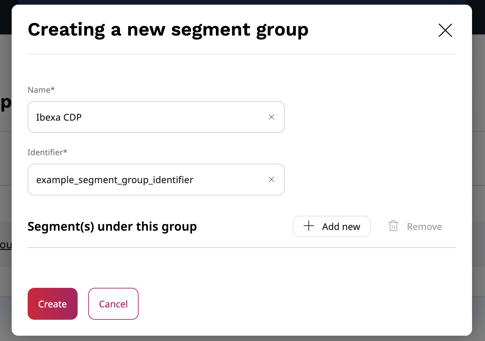
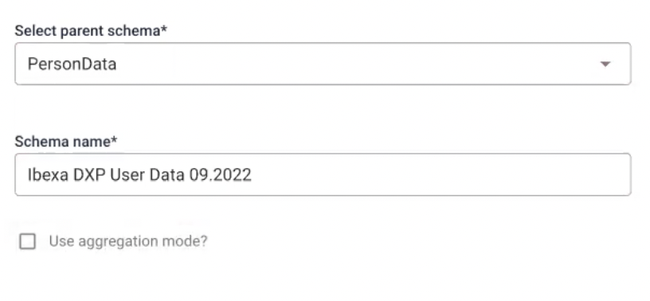
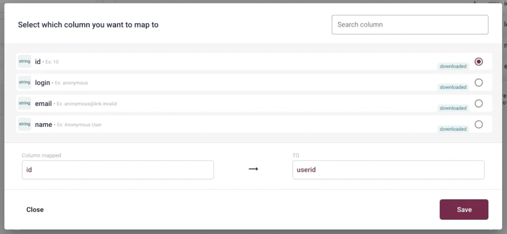
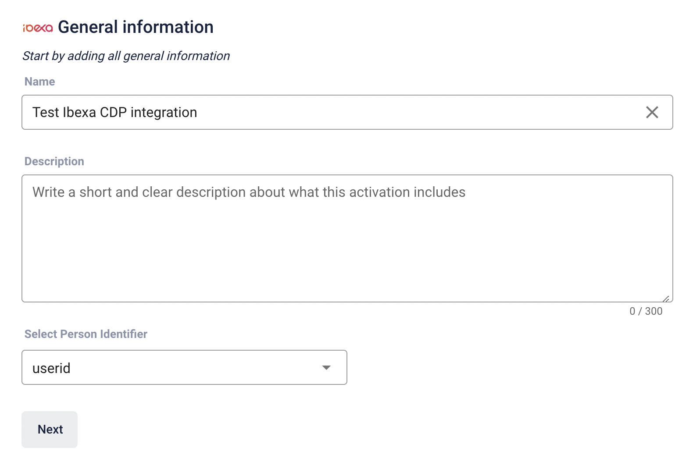
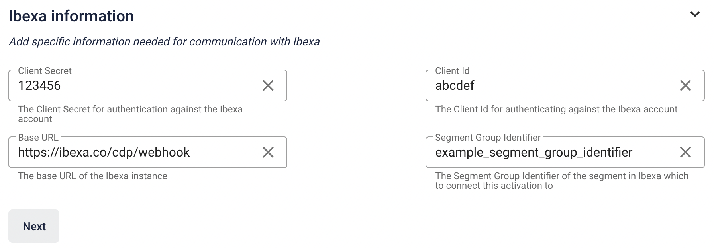

# CDP activation

## Configuration

To configure Ibexa CDP, edit the `config/packages/ibexa_cdp.yaml` file:

```yaml
ezplatform:
    system:
        default:
            cdp:
                account_number: 123456
                user_data_streaming:
                    stream_id: 00000000-00000000-00000000-00000000
                activations:
                    client_id: '%env(CDP_ACTIVATION_CLIENT_ID)%'
                    client_secret: '%env(CDP_ACTIVATION_CLIENT_SECRET)%'
                    segment_group_identifier: example_segment_group_identifier
```

All configuration settings are described below.
You can follow them step by step to set up your Ibexa CDP.

### Segment group

First, create a segment group in the Back Office.
It will serve as a container for all segments data generated by Ibexa CDP.
Go to **Admin** -> **Segments** and select **Create**.
Fill in name and identifier for a segment group.
Choose wisely, as once connected to CDP Segment Group cannot be changed.



Next, add a segment group identifier to the configuration.

!!! caution "Ibexa CDP Segment Group"

    After you create the Segment Group in the Back Office and connect it to Ibexa CDP, you cannot change it in any way, including edit its name.

## Account number

Now, fill in the account number.
Log in to Ibexa CDP and in the top right corner, select available accounts.


A pop-up window displays with a list of all available accounts and their numbers.


## User Data Streaming

You need to specify a source of the user data that Ibexa CDP will connect to.
To do so, go to **Data Manager** in **Tools** section and select **Create new dataflow**.
It will take you to a Dataflow Creator, where in five steps you will set up a data streaming.

### General Information

In the **General Information** section, specify dataflow name,
choose **Stream File** as a source of user data and **CDP** as a destination,
where they will be sent for processing.

### Download

In the **Download** section, select **Stream file**. 
Copy generated steam ID and paste it into the `config/packages/ibexa_cdp.yaml` file under `stream_id`.
It allows you to establish a datastream from the Streaming API into the Data Manager.

Next, you need to export your user data to the CDP.
Go to your installation and use this command:

```bash
php bin/console ibexa:cdp:stream-user-data --draft
```

There are two versions of this command `--draft/--no-draft`.
The first one is used to send the test user data to the Data Manager.
If it passes a validation test in the **Activation** section, use the latter one to send a full version.

Next, go back to Ibexa CDP and select **Validate & download**.
If the file passes, you will see a confirmation message.
Now, you can go to the **File mapping** section.

### File mapping

Mapping is completed automatically, the system fills all required information and shows available columns with datapoints on the right.
You can change their names if needed or disallow empty fields by checking **Mandatory**.
If the provided file contains empty values, this option is not available.

If provided file is not recognized, the system will require you to fill in the parsing-options manually or select an appropriate format.
If you make any alterations, select the **Parse File** to generate columns with new data.

### Transform & Map

In the **Transform & Map** section you transform data and map it to a schema.
At this point, you can map **emial** to **email** and **id** to **integer** to get custom columns.

Next, select **Create schema based on the downloaded columns**.
It will move you to Schema Creator.
There, choose **PersonalData** as a parent and name the schema. 



Next, select all the columns and set Person Identifier as **userid**.


If you used PersonData or Catalog type schemas, the system will require
specifying the Write Mode that will be applied to them.

**Append** (default one) allows new data to overwrite the old one but leaves existing entries unaffected.
All entries are stored in the dataset, unchanged by updating dataflow.
For example, if a customer unsubscribes a newsletter, their email will remain in the system.
**Overwrite** completely removes the original dataset and replaces it with the new one every time the dataflow runs.

Next, select **userid** from a **Schema columns section** on the right and map it to **id**.



### Activation

In this section you will test the dataflow with provided test user data.
If everything passes, go to your installation and export production data with this command:

```bash
php bin/console ibexa:cdp:stream-user-data --no-draft
```

Now you can run and activate the dataflow.

### Build new Audience/Segment

Go to **Audience Builder** and select **Build new audience**.
When naming the audience remember, you will need to find it in a drop-down list during activation.
There, you can choose conditions from `did`, `did not` or `have`.
The conditions `did` and `did not` allow you to use events like buy, visit or add to a basket from online tracking.
- `have` conditions are tied to personal characteristics and can be used to track the sum of all buys or top-visited categories.

In the Audience Builder you can also connect created audiences to the activations.

## Activation

Activation synchronises data from Ibexa CDP to the Ibexa DXP.
When you specify a segment, you can activate it on multiple communication channels, such as newsletters or commercials.
You can configure multiple activations based data flows.

First, from the menu bar, select **Activations**  and create a new **Ibexa** activation.
Specify name of your activation, select `userid` as **Person Identifier** and click **Next**.



Next, you can fill in **Ibexa information** they must match the ones provided in the YAML configuration:

- **Client Secret** and **Client ID** - are used to authenticate against Webhook endpoint. In the configuration they are taken from environment variables in `.env` file.

- **Segment Group Identifier** - identifier of the segment group in Ibexa DXP. It points to a segment group where all the CDP audiences will be stored.
- **Base URL** - URL of your instance with added `/cdp/webhook` at the end.



Finally, you can specify the audiences you wish to include.

!!! note "CDP requests"

    All CDP requests are logged in with `debug` severity.

## Add Client-side Tracking

The final step is setting up a tracking script.
It requires a head tracking script between the `<head></head>` tags on your website
and a main script after the head script, and cookie consent.
You can do it by following [tutorial in the documentation](https://support.raptorsmartadvisor.com/hc/en-us/articles/115000656909-Client-side-Tracking).

Now, you need to add a tracker to specific places in your website where you want to track users.
For example, add this tracker to the Landing Page template if you want to track user entrances.

```js
raptor.trackEvent('visit', ..., ...);
```
or buys:

```js
  //Parameters for Product 1
raptor.trackEvent('buy', ..., ...);
  //Parameters for Product 2
raptor.trackEvent('buy', ..., ...);
```

For tracing to be effective, you also need to send ID of a logged-in user in the same way.
Add the user ID information by using below script:

```js
raptor.push("setRuid","USER_ID_HERE")
```

For more information on tracking events, see [the documentation](https://support.raptorsmartadvisor.com/hc/en-us/articles/201912411-Tracking-Events).